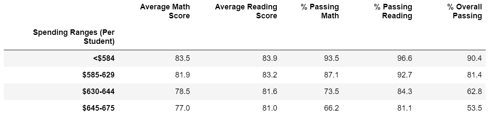

# School_District_Analysis
using pandas in Juptyter Notebooks for exploratory data analysis of a school district

## 1. Overview: 
We are working on a project to uncover data trends within a single school district. Specifically, we want to better understand the relationship between reading/math test scores and a number of other variables such as school size, type, and funding. After initially performing this [analysis](https://github.com/mathaim/School_District_Analysis/blob/main/PyCitySchools.ipynb
) for all students in the 15 schools in the district, we realized there was academic dishonesty among the ninth graders of Thomas High School. We needed to drop these values from the data and re-perform the analysis.

### Resources:
- Data Source: students_complete.csv, schools_complete.csv
- Software: Python 3.6.1
- Tools: Jupyter Notebook 6.1.4

## 2. Results: 

### How is the district summary affected?

- By dropping the innacurate 9th grade data, we see slight changes in our district summary. Prior to dropping the data, we showed 65.2% of students in the district passing both math and reading tests. After dropping the data, we show only 64.9% of students in the district passing both tests. This drop in percentage is because the % Passing Math went from 75.0% to 74.8% and the % Passing Reading went from 85.8% to 85.7%. Similarily, the districts average scores have decreased from 70.0 to 78.9 for math. This makes sense we dropped data of kids that cheated, so their recorded scores were probably high. When we lose these values, we expect the average to drop. Average reading score stayed the same. 

### How is the school summary affected?

 
 
 - The only school that has changed is Thomas High School, which makes sense. The percentage of overall passing drops slightly from 90.94% to 90.63%. It makes sense that we wouldn't observe a huge drop in percentage, as the denominator now excludes 9th graders as well. We see similar slight drops in percentage of reading passed and percentage of math passed. Average math score also dropped slightly. Interestingly, the average reading score increased slightly from 83.94% to 83.89% after we dropped the 9th graders. 
  
### How does replacing the ninth graders’ math and reading scores affect Thomas High School’s performance relative to the other schools?

 
 
 - Thomas High School still ranks 2nd in terms of % Overall Passing, behind only Cabrera High School.
 
### How does replacing the ninth-grade scores affect math scores by grade?

- The ninth grade average reading score dropped from 78.94 to 78.74. The other grades' averages remained the same, which we expected.

### How does replacing the ninth-grade scores affect reading scores by grade?

- The ninth grade average reading score dropped from 81.91 to 81.83. The other grades' averages remained the same, which we expected.

### How does replacing the ninth-grade scores affect scores by school spending?

- Replacing the ninth-grade scores did not affect scores by school spending in a meaningful way.

### How does replacing the ninth-grade scores affect scores by school size?

- Replacing the ninth-grade scores did not affect the scores by school size in a meaningful way.

### How does replacing the ninth-grade scores affect scores by school type?

- Replacing the ninth-grade scores did not affect the scores by school type in a meaningful way.
## 3. Summary: 

In summary, when we replaced the ninth grade at Thomas High School have been replaced with NaNs, there were four noteworthy changes in the district summary:

1. Overall passing rate decreased
2. Math passing rate decreased
3. Reading passing rate decreased
4. Average math score decreased
